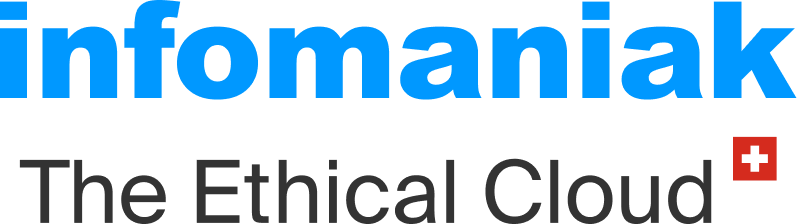

## 🌐 Choose your language

**[🇬🇧 English](README.md)** · **[🇫🇷 Lire la version française](README.fr.md)**

---

# NeoMundi AI Observatory

**Measuring AI behavior over time.**

The NeoMundi AI Observatory is an open research initiative dedicated to observing, measuring and documenting how AI systems behave across repeated conditions.

It focuses on stability, variability, drift, factual validity, cost, latency and conditions of observation.

NeoMundi does not aim to publish rankings or proclamations.
It aims to produce measurements, traces, methods and public evidence that can be discussed, improved and reused.

---

## Purpose

AI systems are increasingly used in sensitive contexts, but their behavior can change silently across time, providers, prompts, policies, configurations or deployment conditions.

The NeoMundi AI Observatory exists to help answer simple questions:

* What did we observe?
* Under which conditions did we observe it?
* How stable or variable was the behavior?
* What changed over time?
* What can be measured, and what must remain interpretation?

The Observatory distinguishes observation from interpretation.

---

## Research programs

The Observatory currently organizes its work around recurring research programs.

### Monthly AI Cartography

Comparative measurement campaigns designed to observe AI system behavior across shared conditions.

Repository:
[NeoMundi AI Behavior Cartography](https://github.com/neomundi-io/ai-behavior-cartography)

The monthly cartography focuses on cross-system comparison under controlled or documented observation conditions.

It may include measurements related to:

* stability;
* variability;
* factual validity;
* cost;
* latency;
* response structure;
* observation limits.

### Weekly AI Barometer

Repeated measurements designed to detect behavioral drift over time.

Repository:
[NeoMundi Weekly Barometer](https://github.com/neomundi-io/NeoMundi-Weekly-Barometer)

The weekly barometer focuses on temporal monitoring: observing whether AI systems remain stable, drift, change regime or behave differently across repeated measurement cycles.

---

## Progressive research tracks

Additional research tracks will be introduced progressively as the Observatory develops.

These may include:

* **Weekly topical question**
  A recurring public question linked to current events, designed to observe how AI systems respond to fresh, socially relevant or time-sensitive topics.

* **Intra-provider measurements**
  Repeated measurements within the same provider or model family, designed to observe internal variability, consistency, drift and regime changes.

* **Vertical sector measurements**
  Domain-specific observation tracks for fields such as law, healthcare, finance, education, public administration or cybersecurity.

* **External reviews and audits**
  Independent reviews, methodological feedback, contributor-led analyses and public commentary on released results.

* **Additional experimental tracks**
  New observation formats may be introduced as methods, contributors and datasets mature.

These tracks will be documented progressively. They should not be read as final claims, certifications or rankings.

---

## Contribution framework

The Observatory is launched with a lightweight contribution framework for the exploratory cycle running from June to December 2026.

Reference version:

* [French reference version — Esprit NeoMundi & cadre de contribution v1.0](./governance/esprit-neomundi-cadre-contribution-v1.0-fr.md)

Courtesy translations:

* [English version — NeoMundi Spirit & Contribution Framework v1.0](./governance/neomundi-spirit-contribution-framework-v1.0-en.md)
* [Spanish version — Marco de contribución y espíritu NeoMundi v1.0](./governance/marco-contribucion-espiritu-neomundi-v1.0-es.md)

The French version is the reference version.
Translations are provided to support understanding and international participation.

---

## Contribute

NeoMundi Recherche welcomes contributions in:

* methodology and protocol;
* data analysis;
* legal, ethical and compliance review;
* writing, translation and pedagogy;
* technical documentation and infrastructure;
* public relations, partnerships and administration;
* other useful contributions.

The current cycle is exploratory, volunteer-based and limited in scope.

Before proposing a contribution, please read the contribution framework above.

A public contribution form will be made available through the official NeoMundi website.

---

## Contribution principle

Ideas travel.
Formalized contributions are attributed.
Signed texts are respected.
Sensitive data is protected.
Published archives become stable.

The Observatory is built to encourage cooperation without extraction, attribution without ego capture, and measurement without proclamation.

---

## Data and confidentiality

By default, contributors work on public, aggregated, anonymized or pseudonymized information.

Access to sensitive information is not automatic.

Some information may remain restricted, including:

* real provider identities;
* internal mappings;
* API keys;
* detailed costs;
* unpublished raw results;
* technical or strategic information.

A separate confidentiality agreement may be required before access to non-public information.

---

## External governance reference

The NeoMundi contribution framework is inspired in part by the Governance Participation Discipline v0.1 and the Collaborative Participation Framework v0.1 published by James Aull / MagicianzCardstock LLC:

[Governance Participation Discipline](https://github.com/magicianzcardstockllc/governance-participation-discipline)

James Aull is a member of the NeoMundi orientation and vigilance committee. He is the founder of ASRO™ — AI Systems Reliability Operator, specialized in governed-state witness evidence, AI governance and attestation frameworks. He is based in Twin Lake, Michigan, United States.

This reference is used as an external guardrail on contribution, attribution, non-extraction and limits of authority.

It does not place NeoMundi under the authority of this framework and does not create institutional dependency.

---

## Repository role

This repository is the public entry point for the NeoMundi AI Observatory.

It contains:

* the contribution framework;
* courtesy translations;
* links to research programs;
* contributor onboarding material;
* public orientation documents.

Detailed datasets, scripts, releases and technical artifacts are published in dedicated repositories.

---

## NeoMundi links

- Official website: [neomundi.org](https://neomundi.org)
- ControlTower demo: [controltower.neomundi.io/welcome](https://controltower.neomundi.io/welcome)
- GitHub organization: [github.com/neomundi-io](https://github.com/neomundi-io)
- Theoretical Framework (Law E) — FR: [DOI 10.5281/zenodo.19385052](https://doi.org/10.5281/zenodo.19385052)
- Contact: [contact@neomundi.org](mailto:contact@neomundi.org)

For industrial use cases, runtime measurement, integration or ControlTower-related discussions, please contact NeoMundi directly.

---

## Ecosystem & Infrastructure Support

The NeoMundi AI Observatory develops its work through an open ecosystem of technical, research, governance and infrastructure contributors.

### Infrastructure support

The Observatory is supported by sovereign infrastructure partners, including Infomaniak.

### NVIDIA Inception

NeoMundi is a member of the NVIDIA Inception program.

These relationships support the development and operation of independent AI measurement, auditability and runtime governance capabilities. They do not imply endorsement of the Observatory’s research findings, measurements or interpretations by the organisations named above.

© 2025 NVIDIA, the NVIDIA logo, and NVIDIA Inception are trademarks and/or registered trademarks of NVIDIA Corporation in the U.S. and other countries.

---

## License

This repository currently uses the Apache-2.0 license.

Specific datasets, reports, translations or external contributions may include additional notices where required.
